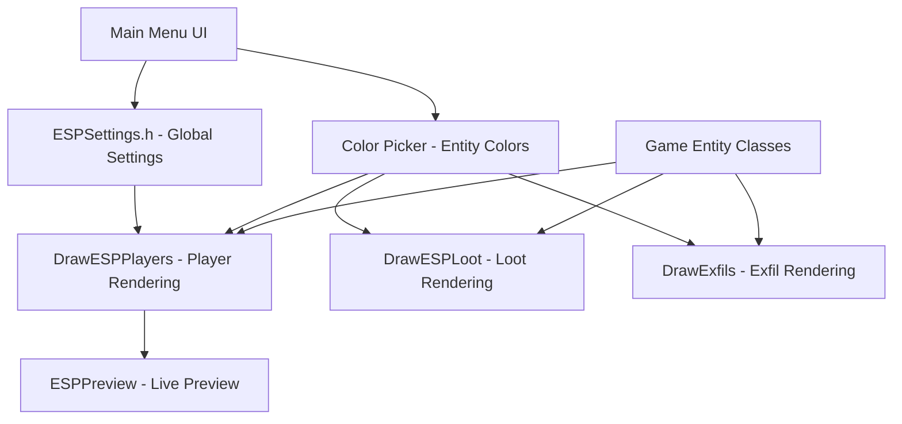

# CyNickal Software EFT - Entity ESP System Walkthrough

This document provides a comprehensive breakdown of the Entity ESP system, including player ESP, loot ESP, exfil ESP, color management, and UI settings. This guide is designed to help you implement similar functionality in another program.

---

## Architecture Overview

The ESP system in CyNickal Software EFT follows a modular architecture:



---

## Default ESP Colors

This section lists all default color values used across different ESP modules.

### Overlay ESP (Player/Enemy)
Defined in [ESPSettings.h](file:///c:/Users/Eddium%20Ally/Documents/CyNickal-Software-EFT-master/CyNickal%20Software%20EFT/GUI/ESP/ESPSettings.h).

| Feature | RGB Color | Visual Description |
| :--- | :--- | :--- |
| **Box Color** | `200, 50, 200` | Purple/Pink |
| **Box Fill** | `0, 0, 0, 50` | Transparent Black |
| **Skeleton** | `200, 50, 200` | Purple/Pink |
| **Name Text** | `255, 255, 255` | White |
| **Distance** | `0, 200, 255` | Cyan/Light Blue |
| **Weapon** | `200, 200, 0` | Yellow |
| **Head Dot** | `255, 0, 0` | Red |

### Fuser & Radar Colors
Defined in [Color Picker.h](file:///c:/Users/Eddium%20Ally/Documents/CyNickal-Software-EFT-master/CyNickal%20Software%20EFT/GUI/Color%20Picker/Color%20Picker.h). These colors are consistent across the 3D Fuser ESP and 2D Radar.

| Entity Type | RGB Color | Visual Description |
| :--- | :--- | :--- |
| **PMC** | `200, 0, 0` | Red |
| **Scav** | `200, 200, 0` | Yellow |
| **Player Scav** | `220, 170, 0` | Orange/Gold |
| **Boss** | `225, 0, 225` | Magenta |
| **Local Player** | `0, 200, 0` | Green (Radar Only) |
| **Loot** | `0, 150, 150` | Teal |
| **Container** | `108, 150, 150` | Dark Teal |
| **Exfil** | `25, 225, 25` | Bright Green |
| **Weapon Text** | `255, 255, 255` | White (Fuser Only) |

---

## Text & Font Settings

The ESP system uses a custom mono-spaced font for maximum legibility and consistent alignment.

### Font Details
- **Font Family**: IBM Plex Mono
- **Weight**: SemiBold
- **Size**: `16.0px` (Base size)
- **Scaling**: Support for DPI-aware font scaling is enabled via `io.ConfigDpiScaleFonts`.

### Layout & Spacing
- **Vertical Spacing**: Multi-line info (Name, Weapon, Ammo) uses `ImGui::GetTextLineHeight()` for consistent line gaps.
- **Vertical Alignment**:
    - **Above Head Info**: Base offset of `-15.0px` from the head bone, stacking upwards for additional lines.
    - **Below Box Info**: Base offset of `+5.0px` from the bottom of the bounding box (used for distance).
- **Horizontal Alignment**: All text is horizontally centered relative to the target's screen position using `ImGui::CalcTextSize`.

---

## 1. Global ESP Settings

### File: [ESPSettings.h](file:///c:/Users/Eddium%20Ally/Documents/CyNickal-Software-EFT-master/CyNickal%20Software%20EFT/GUI/ESP/ESPSettings.h)

This header defines all the ESP configuration options as `inline` global variables within namespaces. This makes them easily accessible throughout the codebase.

```cpp
namespace ESPSettings {
    namespace Enemy {
        // ========== BOX ESP ==========
        inline bool bBoxEnabled = true;
        inline int boxStyle = 0;  // 0=Full Box, 1=Corners Only
        inline ImColor boxColor = ImColor(200, 50, 200);  // Magenta/Purple
        inline float boxThickness = 1.5f;
        inline bool bBoxFilled = false;
        inline ImColor boxFillColor = ImColor(0, 0, 0, 50);  // Semi-transparent black
        
        // ========== SKELETON ESP ==========
        inline bool bSkeletonEnabled = true;
        inline ImColor skeletonColor = ImColor(200, 50, 200);  // Magenta/Purple
        inline float skeletonThickness = 2.0f;
        
        // Individual bone group toggles
        inline bool bBonesHead = true;    // Head to neck
        inline bool bBonesSpine = true;   // Neck, spine, pelvis
        inline bool bBonesArmsL = true;   // Left arm chain
        inline bool bBonesArmsR = true;   // Right arm chain
        inline bool bBonesLegsL = true;   // Left leg chain
        inline bool bBonesLegsR = true;   // Right leg chain
        
        // ========== INFO TEXT ESP ==========
        inline bool bNameEnabled = true;
        inline ImColor nameColor = ImColor(255, 255, 255);  // White
        inline bool bDistanceEnabled = true;
        inline ImColor distanceColor = ImColor(0, 200, 255);  // Cyan
        inline bool bHealthEnabled = false;
        inline bool bWeaponEnabled = true;
        inline ImColor weaponColor = ImColor(200, 200, 0);  // Yellow
        
        // ========== HEAD DOT ==========
        inline bool bHeadDotEnabled = true;
        inline ImColor headDotColor = ImColor(255, 0, 0);  // Red
        inline float headDotRadius = 3.0f;
    }
}
```

### Key Color Values Summary (RGB)

| Element | Color | RGB Value |
|---------|-------|-----------|
| Box/Skeleton | Magenta | `RGB(200, 50, 200)` |
| Name | White | `RGB(255, 255, 255)` |
| Distance | Cyan | `RGB(0, 200, 255)` |
| Weapon | Yellow | `RGB(200, 200, 0)` |
| Head Dot | Red | `RGB(255, 0, 0)` |
| Box Fill | Black (50% alpha) | `RGBA(0, 0, 0, 50)` |

---

## 2. Entity-Specific Colors (Fuser and Radar)

### File: [Color Picker.h](file:///c:/Users/Eddium%20Ally/Documents/CyNickal-Software-EFT-master/CyNickal%20Software%20EFT/GUI/Color%20Picker/Color%20Picker.h)

The system uses two separate color namespaces: **Fuser** (3D world ESP) and **Radar** (2D minimap).

```cpp
namespace ColorPicker
{
    namespace Fuser  // 3D ESP Colors
    {
        inline ImColor m_PMCColor{ ImColor(200, 0, 0) };        // Red - Enemy PMC
        inline ImColor m_ScavColor{ ImColor(200, 200, 0) };     // Yellow - AI Scav
        inline ImColor m_PlayerScavColor{ ImColor(220, 170, 0) }; // Orange - Player Scav
        inline ImColor m_BossColor{ ImColor(225, 0, 225) };     // Magenta - Boss
        inline ImColor m_LootColor{ ImColor(0, 150, 150) };     // Teal - Loot Items
        inline ImColor m_ContainerColor{ ImColor(108, 150, 150) }; // Light Teal - Containers
        inline ImColor m_ExfilColor{ ImColor(25, 225, 25) };    // Green - Extraction Points
        inline ImColor m_WeaponTextColor{ ImColor(255, 255, 255) }; // White
    }

    namespace Radar  // 2D Radar Colors
    {
        inline ImColor m_PMCColor{ ImColor(200, 0, 0) };        // Red
        inline ImColor m_ScavColor{ ImColor(200, 200, 0) };     // Yellow
        inline ImColor m_PlayerScavColor{ ImColor(220, 170, 0) }; // Orange
        inline ImColor m_LocalPlayerColor{ ImColor(0, 200, 0) }; // Green - Local Player
        inline ImColor m_BossColor{ ImColor(225, 0, 225) };     // Magenta
        inline ImColor m_LootColor{ ImColor(0, 150, 150) };     // Teal
        inline ImColor m_ContainerColor{ ImColor(108, 150, 150) }; // Light Teal
        inline ImColor m_ExfilColor{ ImColor(25, 225, 25) };    // Green
    }
}
```

### Entity Color Summary Table

| Entity Type | Fuser Color | Radar Color | RGB Value |
|------------|-------------|-------------|-----------|
| PMC (Enemy) | Red | Red | `RGB(200, 0, 0)` |
| AI Scav | Yellow | Yellow | `RGB(200, 200, 0)` |
| Player Scav | Orange | Orange | `RGB(220, 170, 0)` |
| Boss | Magenta | Magenta | `RGB(225, 0, 225)` |
| Loot Items | Teal | Teal | `RGB(0, 150, 150)` |
| Containers | Light Teal | Light Teal | `RGB(108, 150, 150)` |
| Exfil Points | Green | Green | `RGB(25, 225, 25)` |
| Local Player | N/A | Green | `RGB(0, 200, 0)` |

---

## 3. Player ESP Implementation

### File: [Players.cpp](file:///c:/Users/Eddium%20Ally/Documents/CyNickal-Software-EFT-master/CyNickal%20Software%20EFT/GUI/Fuser/Draw/Players.cpp)

### 3.1 Box Drawing

The box ESP supports two styles: **Full** and **Corners Only**.

```cpp
void DrawESPPlayers::DrawBox(ImDrawList* drawList, ImVec2 min, ImVec2 max, 
    ImColor color, float thickness, int style, bool filled, ImColor fillColor) 
{
    // Optional filled background
    if (filled) {
        drawList->AddRectFilled(min, max, fillColor);
    }

    if (style == 0) { 
        // FULL BOX - Complete rectangle outline
        drawList->AddRect(min, max, color, 0.0f, 0, thickness);
    } 
    else { 
        // CORNERS ONLY - Only draw corner brackets
        float sizeX = (max.x - min.x) / 4.0f;  // Corner width = 1/4 of box width
        float sizeY = (max.y - min.y) / 7.0f;  // Corner height = 1/7 of box height

        // Top Left Corner
        drawList->AddLine(min, ImVec2(min.x + sizeX, min.y), color, thickness);
        drawList->AddLine(min, ImVec2(min.x, min.y + sizeY), color, thickness);
        // Top Right Corner
        drawList->AddLine(ImVec2(max.x, min.y), ImVec2(max.x - sizeX, min.y), color, thickness);
        drawList->AddLine(ImVec2(max.x, min.y), ImVec2(max.x, min.y + sizeY), color, thickness);
        // Bottom Left Corner
        drawList->AddLine(ImVec2(min.x, max.y), ImVec2(min.x + sizeX, max.y), color, thickness);
        drawList->AddLine(ImVec2(min.x, max.y), ImVec2(min.x, max.y - sizeY), color, thickness);
        // Bottom Right Corner
        drawList->AddLine(max, ImVec2(max.x - sizeX, max.y), color, thickness);
        drawList->AddLine(max, ImVec2(max.x, max.y - sizeY), color, thickness);
    }
}
```

### 3.2 Bounding Box Calculation

The bounding box is calculated from projected bone positions:

```cpp
// Calculate Bounding Box from all projected bones
ImVec2 bMin(10000, 10000), bMax(-10000, -10000);
bool anyOnScreen = false;

for (const auto& bone : ProjectedBones) {
    if (bone.bIsOnScreen) {
        bMin.x = ImMin(bMin.x, bone.ScreenPos.x);
        bMin.y = ImMin(bMin.y, bone.ScreenPos.y);
        bMax.x = ImMax(bMax.x, bone.ScreenPos.x);
        bMax.y = ImMax(bMax.y, bone.ScreenPos.y);
        anyOnScreen = true;
    }
}

if (!anyOnScreen) return;  // Skip if no bones visible

// Add window position offset
bMin.x += WindowPos.x; bMin.y += WindowPos.y;
bMax.x += WindowPos.x; bMax.y += WindowPos.y;
```

### 3.3 Skeleton Drawing

The skeleton is drawn by connecting bone pairs. The bone indices are mapped using `Sketon_MyIndicies`:

```cpp
void DrawESPPlayers::DrawSkeleton(const ImVec2& WindowPos, ImDrawList* DrawList, 
    const std::array<ProjectedBoneInfo, SKELETON_NUMBONES>& ProjectedBones)
{
    using namespace ESPSettings::Enemy;
    ImColor col = skeletonColor;
    float thick = skeletonThickness;

    // HEAD - Head to Neck
    if (bBonesHead) 
        ConnectBones(ProjectedBones[Sketon_MyIndicies[EBoneIndex::Head]], 
                     ProjectedBones[Sketon_MyIndicies[EBoneIndex::Neck]], 
                     WindowPos, DrawList, col, thick);
    
    // SPINE - Neck to Spine to Pelvis
    if (bBonesSpine) {
        ConnectBones(ProjectedBones[Sketon_MyIndicies[EBoneIndex::Neck]], 
                     ProjectedBones[Sketon_MyIndicies[EBoneIndex::Spine3]], 
                     WindowPos, DrawList, col, thick);
        ConnectBones(ProjectedBones[Sketon_MyIndicies[EBoneIndex::Spine3]], 
                     ProjectedBones[Sketon_MyIndicies[EBoneIndex::Pelvis]], 
                     WindowPos, DrawList, col, thick);
    }

    // LEFT LEG - Pelvis -> LThigh1 -> LThigh2 -> LCalf -> LFoot
    if (bBonesLegsL) {
        ConnectBones(ProjectedBones[Sketon_MyIndicies[EBoneIndex::Pelvis]], 
                     ProjectedBones[Sketon_MyIndicies[EBoneIndex::LThigh1]], 
                     WindowPos, DrawList, col, thick);
        // ... continue chain
    }
    // Similar for RIGHT LEG, LEFT ARM, RIGHT ARM
}

// Helper function to draw a line between two bones
void ConnectBones(const ProjectedBoneInfo& BoneA, const ProjectedBoneInfo& BoneB, 
    const ImVec2& WindowPos, ImDrawList* DrawList, const ImColor& Color, float Thickness)
{
    if (!BoneA.bIsOnScreen || !BoneB.bIsOnScreen) return;

    DrawList->AddLine(
        { WindowPos.x + BoneA.ScreenPos.x, WindowPos.y + BoneA.ScreenPos.y },
        { WindowPos.x + BoneB.ScreenPos.x, WindowPos.y + BoneB.ScreenPos.y },
        Color,
        Thickness
    );
}
```

### 3.4 Info Text (Name, Weapon, Distance)

```cpp
// Draw text centered at a position
static void DrawTextAtPosition(ImDrawList* DrawList, const ImVec2& Position, 
    const ImColor& Color, const std::string& Text)
{
    auto TextSize = ImGui::CalcTextSize(Text.c_str());
    DrawList->AddText(
        ImVec2(Position.x - (TextSize.x / 2.0f), Position.y),
        Color,
        Text.c_str()
    );
}

// Name - Drawn above head bone
if (bNameEnabled) {
    std::string Text = Player.GetBaseName();  // "PMC", "Scav", "PScav", or boss name
    auto& ProjectedHead = ProjectedBones[Sketon_MyIndicies[EBoneIndex::Head]];
    DrawTextAtPosition(DrawList, 
        ImVec2(WindowPos.x + ProjectedHead.ScreenPos.x, 
               WindowPos.y + ProjectedHead.ScreenPos.y - 15.0f - (LineHeight * LineNumber)), 
        nameColor, Text);
    LineNumber++;
}

// Weapon - Drawn above name
if (bWeaponEnabled) {
    auto ItemName = pHands->m_pHeldItem->GetItemName();
    DrawTextAtPosition(DrawList, position, ESPSettings::Enemy::weaponColor, ItemName);
    
    // Also shows ammo: "30 7.62x39mm BP"
    std::string MagText = std::format("{0:d} {1:s}", Magazine->m_CurrentCartridges, Magazine->GetAmmoName());
}

// Distance - Drawn below box
if (bDistanceEnabled) {
    std::string distText = std::format("[{:.0f}m]", Player.GetBonePosition(EBoneIndex::Root).DistanceTo(LocalPlayerPos));
    DrawTextAtPosition(DrawList, ImVec2(x, bMax.y + 5.0f), distanceColor, distText);
}
```

### 3.5 Head Dot

```cpp
if (bHeadDotEnabled) {
    auto& ProjectedHeadPos = ProjectedBones[Sketon_MyIndicies[EBoneIndex::Head]];
    if (ProjectedHeadPos.bIsOnScreen)
        DrawList->AddCircleFilled(
            ImVec2(WindowPos.x + ProjectedHeadPos.ScreenPos.x, 
                   WindowPos.y + ProjectedHeadPos.ScreenPos.y), 
            headDotRadius,  // Default: 3.0f
            headDotColor    // Default: Red
        );
}
```

---

## 4. Entity Color Assignment Logic

### File: [CBaseEFTPlayer.cpp](file:///c:/Users/Eddium%20Ally/Documents/CyNickal-Software-EFT-master/CyNickal%20Software%20EFT/Game/Classes/Players/CBaseEFTPlayer/CBaseEFTPlayer.cpp#L180-206)

Each entity class has `GetFuserColor()` and `GetRadarColor()` methods that return the appropriate color based on entity type.

```cpp
const ImColor CBaseEFTPlayer::GetFuserColor() const
{
    // Priority order: Boss > Player Scav > AI Scav > PMC
    if (IsBoss())
        return ColorPicker::Fuser::m_BossColor;      // Magenta

    if (IsPlayerScav())
        return ColorPicker::Fuser::m_PlayerScavColor; // Orange

    if (IsAi())
        return ColorPicker::Fuser::m_ScavColor;       // Yellow

    return ColorPicker::Fuser::m_PMCColor;            // Red (default for PMCs)
}

const ImColor CBaseEFTPlayer::GetRadarColor() const
{
    // Same logic but uses Radar colors
    if (IsBoss())
        return ColorPicker::Radar::m_BossColor;
    if (IsPlayerScav())
        return ColorPicker::Radar::m_PlayerScavColor;
    if (IsAi())
        return ColorPicker::Radar::m_ScavColor;
    return ColorPicker::Radar::m_PMCColor;
}
```

### Boss Detection

```cpp
const bool CBaseEFTPlayer::IsBoss() const
{
    switch (m_SpawnType)
    {
        case ESpawnType::BigPipe:
        case ESpawnType::BirdEye:
        case ESpawnType::Knight:
        case ESpawnType::Killa:
        case ESpawnType::Kaban:
        case ESpawnType::Partisan:
        case ESpawnType::Sanitar:
        case ESpawnType::Gluhar:
        case ESpawnType::Kolontay:
        case ESpawnType::Tagilla:
        case ESpawnType::Shturman:
        case ESpawnType::Reshala:
            return true;
        default:
            return false;
    }
}
```

---

## 5. Loot ESP Implementation

### File: [Loot.cpp](file:///c:/Users/Eddium%20Ally/Documents/CyNickal-Software-EFT-master/CyNickal%20Software%20EFT/GUI/Fuser/Draw/Loot.cpp)

### Loot Settings

```cpp
class DrawESPLoot
{
public:
    static inline bool bMasterToggle{ true };        // Master on/off
    static inline bool bItemToggle{ true };          // Show loose items
    static inline bool bContainerToggle{ true };     // Show containers
    static inline float fMaxItemDistance{ 50.0f };   // Max distance for items
    static inline float fMaxContainerDistance{ 20.0f }; // Max distance for containers
    static inline int32_t m_MinItemPrice{ -1 };      // Minimum price filter (-1 = show all)
};
```

### Drawing Loot Items

```cpp
void DrawESPLoot::DrawItem(CObservedLootItem& Item, ImDrawList* DrawList, 
    ImVec2 WindowPos, const Vector3& LocalPlayerPos)
{
    if (Item.IsInvalid()) return;

    // Price filter
    if (m_MinItemPrice > 0 && Item.GetItemPrice() < m_MinItemPrice)
        return;

    // World-to-screen projection
    Vector2 ScreenPos{};
    if (!CameraList::W2S(Item.m_Position, ScreenPos)) return;

    // Distance filter
    auto Distance = LocalPlayerPos.DistanceTo(Item.m_Position);
    if (Distance > fMaxItemDistance) return;

    // Format: "ItemName (Price) [Distance]"
    std::string DisplayString = std::format("{0:s} ({1:d}) [{2:.0f}m]", 
        Item.GetName().c_str(), 
        Item.GetItemPrice(), 
        Distance);

    auto TextSize = ImGui::CalcTextSize(DisplayString.c_str());

    DrawList->AddText(
        ImVec2(WindowPos.x + ScreenPos.x - (TextSize.x / 2.0f), 
               WindowPos.y + ScreenPos.y - 10.0f - TextSize.y),
        Item.GetFuserColor(),  // Uses ColorPicker::Fuser::m_LootColor
        DisplayString.c_str()
    );
}
```

### Drawing Containers

```cpp
void DrawESPLoot::DrawContainer(CLootableContainer& Container, ImDrawList* DrawList, 
    ImVec2 WindowPos, const Vector3& LocalPlayerPos)
{
    if (Container.IsInvalid()) return;

    Vector2 ScreenPos{};
    if (!CameraList::W2S(Container.m_Position, ScreenPos)) return;

    auto Distance = LocalPlayerPos.DistanceTo(Container.m_Position);
    if (Distance > fMaxContainerDistance) return;

    // Format: "ContainerName [Distance]"
    std::string DisplayString = std::format("{0:s} [{1:.0f}m]", 
        Container.GetName().c_str(), Distance);

    auto TextSize = ImGui::CalcTextSize(DisplayString.c_str());

    DrawList->AddText(
        ImVec2(WindowPos.x + ScreenPos.x - (TextSize.x / 2.0f), 
               WindowPos.y + ScreenPos.y - 10.0f - TextSize.y),
        Container.GetFuserColor(),  // Uses ColorPicker::Fuser::m_ContainerColor
        DisplayString.c_str()
    );
}
```

### Loot Color Assignment

```cpp
// File: CObservedLootItem.cpp
const ImColor& CObservedLootItem::GetRadarColor() const
{
    return ColorPicker::Radar::m_LootColor;  // RGB(0, 150, 150) - Teal
}

const ImColor& CObservedLootItem::GetFuserColor() const
{
    return ColorPicker::Fuser::m_LootColor;  // RGB(0, 150, 150) - Teal
}

// File: CLootableContainer.cpp
const ImColor& CLootableContainer::GetRadarColor() const
{
    return ColorPicker::Radar::m_ContainerColor;  // RGB(108, 150, 150) - Light Teal
}

const ImColor& CLootableContainer::GetFuserColor() const
{
    return ColorPicker::Fuser::m_ContainerColor;  // RGB(108, 150, 150) - Light Teal
}
```

---

## 6. Exfil ESP Implementation

### File: [Exfils.cpp](file:///c:/Users/Eddium%20Ally/Documents/CyNickal-Software-EFT-master/CyNickal%20Software%20EFT/GUI/Fuser/Draw/Exfils.cpp)

### Exfil Settings

```cpp
class DrawExfils
{
public:
    static inline bool bMasterToggle{ true };  // Master on/off
};
```

### Drawing Exfil Points

```cpp
void DrawExfils::DrawAll(const ImVec2& WindowPos, ImDrawList* DrawList)
{
    if (!bMasterToggle) return;

    if (EFT::pGameWorld == nullptr) return;
    if (EFT::pGameWorld->m_pExfilController == nullptr) return;

    auto& ExfilController = EFT::GetExfilController();
    std::scoped_lock lk(ExfilController.m_ExfilMutex);

    Vector2 ScreenPos{};
    auto LocalPlayerPos = EFT::GetRegisteredPlayers().GetLocalPlayerPosition();

    for (auto& Exfil : ExfilController.m_Exfils)
    {
        // World-to-screen projection
        if (!CameraList::W2S(Exfil.m_Position, ScreenPos)) continue;

        float Distance = LocalPlayerPos.DistanceTo(Exfil.m_Position);

        // Format: "ExfilName [Distance]"
        std::string Text = std::format("{0:s} [{1:.0f}m]", Exfil.m_Name, Distance);
        auto TextSize = ImGui::CalcTextSize(Text.c_str());
        
        DrawList->AddText(
            ImVec2(WindowPos.x + ScreenPos.x - (TextSize.x / 2.0f), 
                   WindowPos.y + ScreenPos.y),
            Exfil.GetFuserColor(),  // RGB(25, 225, 25) - Green
            Text.c_str()
        );
    }
}
```

### Exfil Color Assignment

```cpp
// File: CExfilPoint.cpp
const ImColor& CExfilPoint::GetRadarColor() const
{
    return ColorPicker::Radar::m_ExfilColor;  // RGB(25, 225, 25) - Green
}

const ImColor& CExfilPoint::GetFuserColor() const
{
    return ColorPicker::Fuser::m_ExfilColor;  // RGB(25, 225, 25) - Green
}
```

---

## 7. ESP Preview Panel

### File: [ESPPreview.cpp](file:///c:/Users/Eddium%20Ally/Documents/CyNickal-Software-EFT-master/CyNickal%20Software%20EFT/GUI/ESP/ESPPreview.cpp)

The preview renders a static mannequin using relative bone positions (0.0 to 1.0 coordinates):

```cpp
// Bone positions relative to canvas (centered at 0.5 horizontal)
static const ImVec2 staticBones[] = {
    {0.50f, 0.05f}, // Head (0)
    {0.50f, 0.12f}, // Neck (1)
    {0.50f, 0.30f}, // Spine3 (2)
    {0.50f, 0.50f}, // Pelvis (3)
    // Arms
    {0.45f, 0.15f}, // LUpperArm (4)
    {0.35f, 0.25f}, // LForeArm1 (5)
    {0.30f, 0.35f}, // LForeArm2 (6)
    {0.25f, 0.40f}, // LPalm (7)
    {0.55f, 0.15f}, // RUpperArm (8)
    {0.65f, 0.25f}, // RForeArm1 (9)
    {0.70f, 0.35f}, // RForeArm2 (10)
    {0.75f, 0.40f}, // RPalm (11)
    // Legs
    {0.45f, 0.55f}, // LThigh1 (12)
    {0.43f, 0.70f}, // LThigh2 (13)
    {0.41f, 0.85f}, // LCalf (14)
    {0.40f, 0.95f}, // LFoot (15)
    {0.55f, 0.55f}, // RThigh1 (16)
    {0.57f, 0.70f}, // RThigh2 (17)
    {0.59f, 0.85f}, // RCalf (18)
    {0.60f, 0.95f}  // RFoot (19)
};
```

The preview reads from `ESPSettings::Enemy` namespace and renders the mannequin with current settings, allowing real-time visual feedback.

---

## 8. UI Implementation Patterns

### Custom Toggle Control

```cpp
static bool CustomToggle(const char* label, bool* v)
{
    // Visual toggle switch with green filled circle (ON) or red hollow circle (OFF)
    ImU32 col_circle;
    
    if (*v) {
        col_circle = IM_COL32(50, 200, 50, 255);   // Green - ON
        // Draw filled circle on right side
        draw_list->AddCircleFilled(position, radius - 3.0f, col_circle);
    } else {
        col_circle = IM_COL32(200, 50, 50, 255);   // Red - OFF
        // Draw hollow circle on left side
        draw_list->AddCircle(position, radius - 3.0f, col_circle, 0, 2.0f);
    }
}
```

### Color Picker Button

```cpp
static void ColorPickerButton(const char* label, ImColor& color)
{
    float col[4] = { color.Value.x, color.Value.y, color.Value.z, color.Value.w };
    
    // Display hex color code in red
    char hexBuf[16];
    snprintf(hexBuf, sizeof(hexBuf), "#%02X%02X%02X", 
        (int)(col[0] * 255), (int)(col[1] * 255), (int)(col[2] * 255));
    ImGui::TextColored(ImVec4(0.78f, 0.14f, 0.20f, 1.0f), "%s", hexBuf);
    
    // Color edit popup
    if (ImGui::ColorEdit4(id, col, ImGuiColorEditFlags_NoInputs | ImGuiColorEditFlags_NoLabel))
    {
        color = ImColor(col[0], col[1], col[2], col[3]);
    }
}
```

---

## 9. How to Implement in Your Project

### Step 1: Create Settings File

```cpp
// YourESPSettings.h
#pragma once
#include <imgui.h>

namespace ESPSettings {
    namespace Enemy {
        inline bool bBoxEnabled = true;
        inline int boxStyle = 0;  // 0=Full, 1=Corners
        inline ImColor boxColor = ImColor(200, 50, 200);
        inline float boxThickness = 1.5f;
        // ... add other settings
    }
}
```

### Step 2: Create Color System

```cpp
// ColorConfig.h
#pragma once
#include <imgui.h>

namespace Colors {
    namespace ESP {
        inline ImColor PMC = ImColor(200, 0, 0);
        inline ImColor Scav = ImColor(200, 200, 0);
        inline ImColor PlayerScav = ImColor(220, 170, 0);
        inline ImColor Boss = ImColor(225, 0, 225);
        inline ImColor Loot = ImColor(0, 150, 150);
        inline ImColor Container = ImColor(108, 150, 150);
        inline ImColor Exfil = ImColor(25, 225, 25);
    }
}
```

### Step 3: Implement Entity Color Methods

```cpp
ImColor Entity::GetESPColor() const
{
    switch (m_Type) {
        case EntityType::PMC: return Colors::ESP::PMC;
        case EntityType::Scav: return Colors::ESP::Scav;
        case EntityType::Boss: return Colors::ESP::Boss;
        // etc.
    }
    return Colors::ESP::PMC;  // Default
}
```

### Step 4: Implement Drawing

```cpp
void DrawPlayerESP(const Player& player, ImDrawList* drawList, ImVec2 windowPos)
{
    using namespace ESPSettings::Enemy;
    
    // Project bones to screen
    std::vector<Vec2> bones = ProjectBones(player);
    
    // Calculate bounding box
    auto [bMin, bMax] = CalculateBoundingBox(bones, windowPos);
    
    // Draw box
    if (bBoxEnabled) {
        DrawBox(drawList, bMin, bMax, boxColor, boxThickness, boxStyle);
    }
    
    // Draw skeleton
    if (bSkeletonEnabled) {
        DrawSkeleton(drawList, bones, skeletonColor, skeletonThickness);
    }
    
    // Draw info text
    if (bNameEnabled) DrawName(drawList, player, bones[HEAD], nameColor);
    if (bWeaponEnabled) DrawWeapon(drawList, player, weaponColor);
    if (bDistanceEnabled) DrawDistance(drawList, player, distanceColor);
    if (bHeadDotEnabled) DrawHeadDot(drawList, bones[HEAD], headDotColor, headDotRadius);
}
```

---

## Summary

This walkthrough covered:

1. **ESPSettings.h** - Global ESP configuration with colors and toggles
2. **Color Picker** - Entity-specific color management (Fuser/Radar)
3. **Player ESP** - Box, skeleton, text, and head dot drawing
4. **Loot ESP** - Item and container rendering with price/distance
5. **Exfil ESP** - Extraction point display
6. **Entity Color Logic** - How colors are assigned based on entity type
7. **UI Patterns** - Custom toggle and color picker implementations

The key design patterns are:
- **Namespace organization** for settings and colors
- **Inline static variables** for global access
- **GetFuserColor()/GetRadarColor()** methods on entity classes
- **Conditional rendering** based on toggle states
- **Distance filtering** for performance

