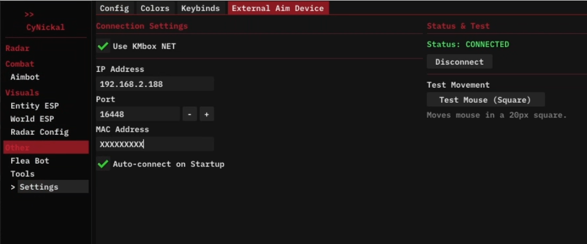
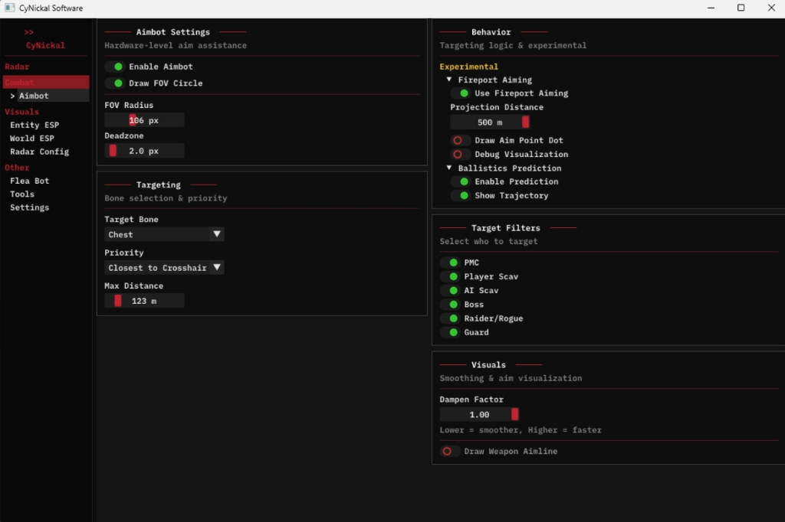
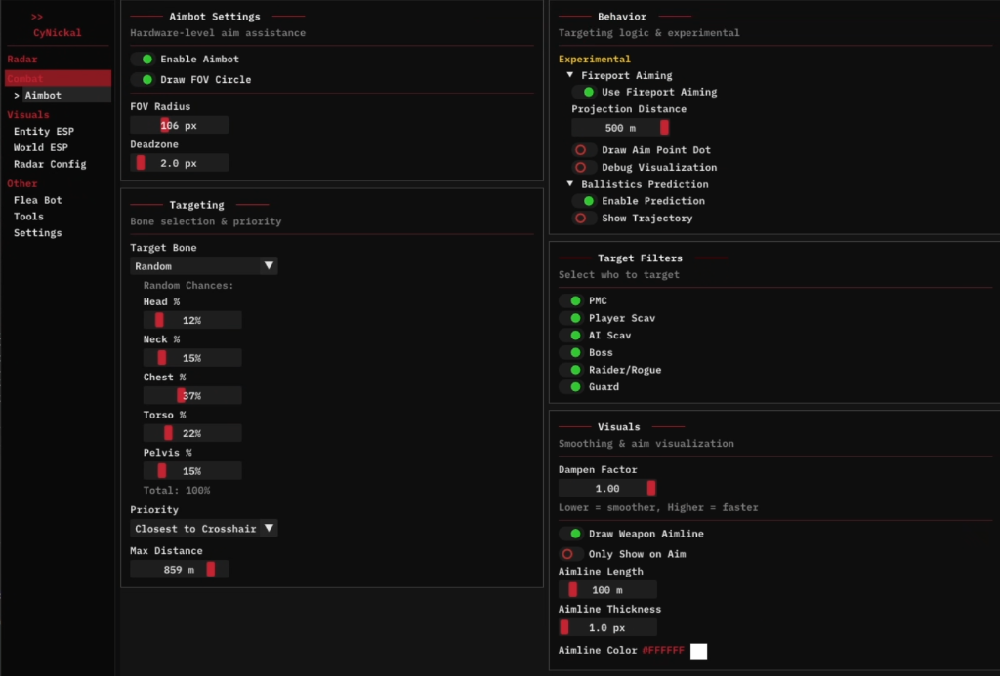
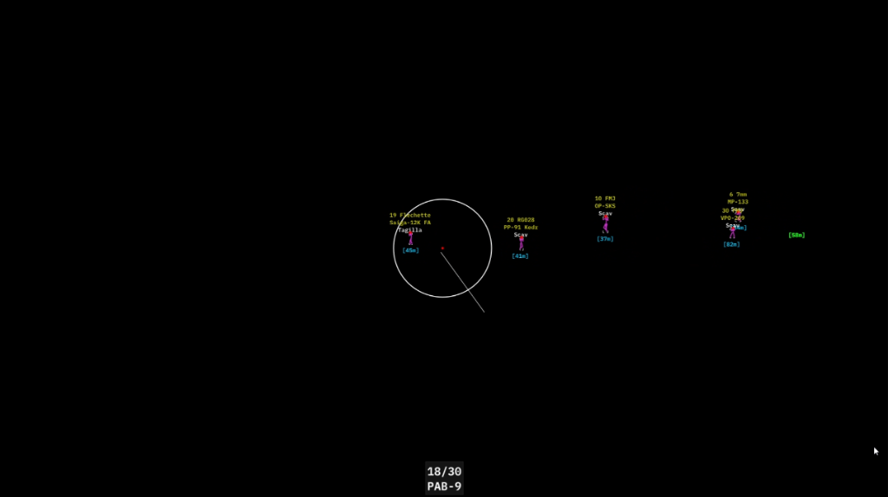

# CyNickal Software EFT DMA (Updated Fork)

This is a feature-rich fork of the original CyNickal Software EFT DMA project. It includes significant improvements to stability, aimbot logic, and visual clarity, ensuring a premium experience.

## Key Features & Improvements

### 🎯 Hardware-Level Aimbot & External Device Support
Now supports **KMbox NET** for secure, external mouse control. The aimbot logic has been overhauled for precision and safety.

- **KMbox NET Integration**: Seamlessly connect and control your hardware aim device.
- **Advanced Smoothing**: New algorithms to humanize movement.
- **Fireport Aiming & Prediction**: Accounts for bullet travel and weapon barrel position (Fireport) for maximum accuracy.
- **Targeting Logic**:
    - **Bone Prioritization**: Customizable random chances for targeting specific bones (Head, Chest, etc.).
    - **Dynamic Filtering**: Smart selection based on crosshair distance and visibility.

  
  

### 👁️ Enhanced Visuals & ESP
The visual overlay has been refined for better information density and aesthetics.

- **Player Skeletons**: Full bone rendering for precise enemy tracking.
- **Rich Entity Info**: Displays Health, Weapon, Ammo, and Distance clearly.
- **Weapon Aimline**: Visualizes exactly where enemies are aiming.
- **Customizable Colors**: Fine-tune colors for every entity type (PMC, Scav, Boss, etc.).

### 🗺️ Precision Radar
The external 2D Radar has been fixed and improved.

- **Correct Aspect Ratio**: The map now scales correctly without distortion, regardless of window size.
- **Accurate Alignment**: Entities are perfectly mapped to their in-game coordinates.

### ⚙️ Stability & Core Improvements
- **Auto-Retry Mechanism**: Automatically detects and initializes the Game World when entering a raid—no more restarts needed.
- **MemProcFS**: High-speed, safe memory reading.

## Original Features
- Hardware level Flea Market bot (Auto-buy).
- Comprehensive Loot & Container ESP.
- Multi-config support.

## Getting Started
Refer to the [Wiki](https://github.com/CyN1ckal/CyNickal-Software-EFT/wiki) (from the original repo) for basic setup instructions. Ensure your DMA hardware and KMbox are properly configured.

---
*Based on CyNickal Software EFT DMA.*
